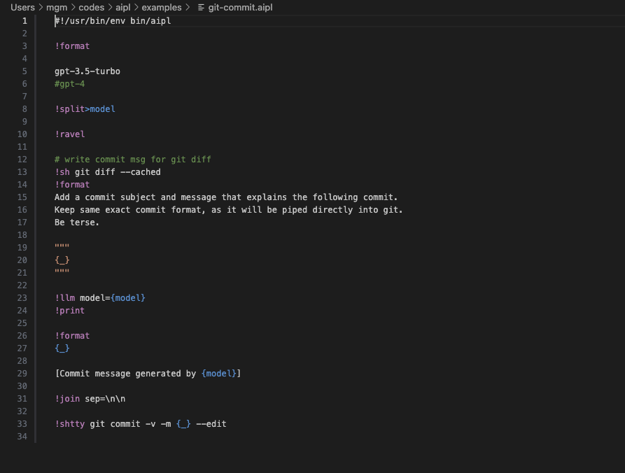

# aipl README

Bare-bones syntax highlight for the experimental [AIPL](https://github.com/saulpw/aipl) language.

## Features

Basic highlighter to make aipl code easier to work with in vscode. 

- All operators in the "standard library" are considered keywords (purple in the screenshot)
- User-defined operators are highlighted in blue
- Input/output and variable references are highlighted as well

## Known Issues

- Prompts that span multiple lines aren't supported yet (eg, in `!format`)
- Keyword args aren't highlighted yet
- No python syntax highlighting yet

### 0.1

Initial release

